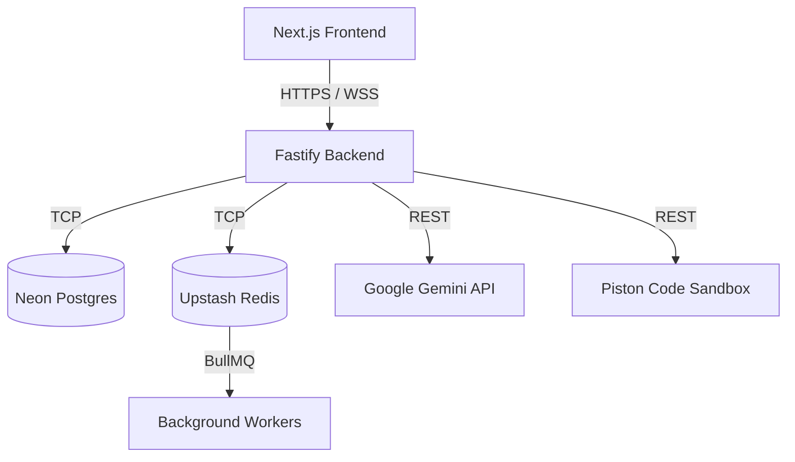

# ⚡ DevForge

> **Command Center for Developer Progression.**

DevForge is a full-stack, AI-powered platform designed to accelerate developer growth. It provides a deep-tech, "Ember Glass" environment where engineers can practice algorithmic problem-solving, undergo AI-driven mock interviews, and dynamically generate targeted resumes.

---

## Key Features

### 1. Neural Profiling & AI Mock Interviews
- **Simulated Interviews:** Engage in technical and behavioral interview rounds powered by the Google Gemini AI.
- **Real-time Scoring:** Get instant, actionable feedback and a calculated `SCORE_RCV` to track your proficiency in areas like System Design, Concurrency, and Data Structures.
- **Targeted Sessions:** Tailor the interview strictly to the role you are targeting.

### 2. Live Arena (DSA Sandbox)
- **Competitive Environment:** Solve algorithmic challenges in a live, in-browser IDE (powered by Monaco Editor).
- **Secure Execution:** Code is safely executed via a Piston sandbox.
- **XP & Leveling System:** Gain a flat +100 XP for every ranked match won, leveling up your profile and pushing you towards the "Grandmaster Tier."

### 3. Smart Resume Generator
- **Job Description Matching:** Input a target job description and DevForge will analyze the delta between the JD and your current profile.
- **Automated Generation:** Dynamically generates optimized resume profiles aimed at drastically increasing ATS hit rates.

### 4. Tech Pulse & System Logs
- **Automated News Fetching:** BullMQ background workers run recurring jobs to fetch the latest tech news.
- **Terminal-style Logs:** A strictly monospace, hacker-aesthetic activity stream to track your progression across the platform.

---

## Tech Stack & Architecture

DevForge is structured as a modern turborepo monorepo, separating concerns into discrete apps and packages.

### Frontend (`apps/frontend`)
- **Framework:** Next.js (App Router), React 19
- **Styling:** Tailwind CSS v4 (Custom "Ember Glass" design system)
- **State Management:** Zustand
- **Icons & Graphics:** Lucide React, SVG Sparklines
- **Editor:** `@monaco-editor/react`

### Backend (`apps/backend`)
- **Framework:** Fastify (Node.js) & TypeScript
- **Database ORM:** Prisma
- **Queue System:** BullMQ (powered by Upstash Serverless Redis)
- **AI Engine:** Google Gemini API
- **Execution Sandbox:** Piston API (Code execution)

### Infrastructure
- **Database:** Neon Serverless PostgreSQL
- **Redis:** Upstash Serverless Redis

---

## Design System: "Ember Glass"

DevForge completely rejects standard SaaS aesthetics. It embraces a highly technical, deep-dark UI.
- **Backgrounds:** Flat, warm-brown dark tones (`#110b09`, `#1a110e`).
- **Typography:** Strictly monospace (`JetBrains Mono`). 
- **Accents:** High-contrast, glowing Ember (`#ea580c`) and Amber (`#f59e0b`).
- **Components:** Bracketed tracking headers (e.g. `[ ARENA_RATING ]`), terminal-style logs (`>_`), and raw hex layouts.

---

## Local Development Setup

### Prerequisites
- Node.js (v22+)
- npm or pnpm
- A Neon PostgreSQL Database
- An Upstash Redis Database
- A Google Gemini API Key

### Installation

1. **Clone the repository:**
   ```bash
   git clone https://github.com/GouravSharma26/DevForge.git
   cd DevForge
   ```

2. **Install dependencies:**
   ```bash
   npm install
   ```

3. **Environment Variables:**
   Set up your `.env` files in both `apps/frontend` and `apps/backend` using the provided `.env.example` templates.
   - *Backend requires:* `DATABASE_URL`, `REDIS_URL` (use `redis://` to avoid TLS timeouts), `GEMINI_API_KEY`, `JWT_SECRET`, `COOKIE_SECRET`, `FRONTEND_URL`, `NEWS_API_KEY`, and `PISTON_API_URL`.
   - *Frontend requires:* `NEXT_PUBLIC_API_URL`.

4. **Database Migration:**
   ```bash
   cd packages/database
   npx prisma migrate deploy
   ```

5. **Run the Development Servers:**
   Open two terminals from the root:
   ```bash
   # Start the frontend (runs on localhost:3000)
   cd apps/frontend && npm run dev
   
   # Start the backend (runs on localhost:5000)
   cd apps/backend && npm run dev
   ```

---

## Deployment Topology & Configuration
DevForge is designed to be deployed across two primary services:
- **Frontend:** Vercel (or similar Edge-enabled platform).
- **Backend:** Render, Railway, or Fly.io (a long-running Node.js process to maintain WebSocket connections and BullMQ workers).

Because the API and Frontend will likely run on different domains (e.g., `api.devforge.com` and `devforge.com`), ensure `CORS_ORIGINS` on the backend includes the frontend domain. Cookies are configured with `SameSite=Lax`, which allows cross-site authentication, but necessitates that both services operate over HTTPS.

## Testing
To run the automated test suite securely, you must configure a dedicated **Test Database**.
Running tests against a production database will result in data pollution or accidental data deletion during the teardown phase. 
Ensure the `DATABASE_URL` during tests points to a completely separate database instance.

---

## Architecture



## Known Limitations

- **State Management:** WebSocket connections and matchmaking queues currently rely on in-memory state. To scale horizontally (run multiple backend instances), this state needs to be migrated to Redis.
- **AI Rate Limits:** Generating AI feedback depends heavily on Gemini API limits. High concurrency may result in degraded mock interview response times.
- **Piston Sandbox:** Extremely heavy code execution loops may hit Piston timeout limits (currently restricted to typical algorithmic constraints).

---

## License
MIT License. See `LICENSE` for more information.
